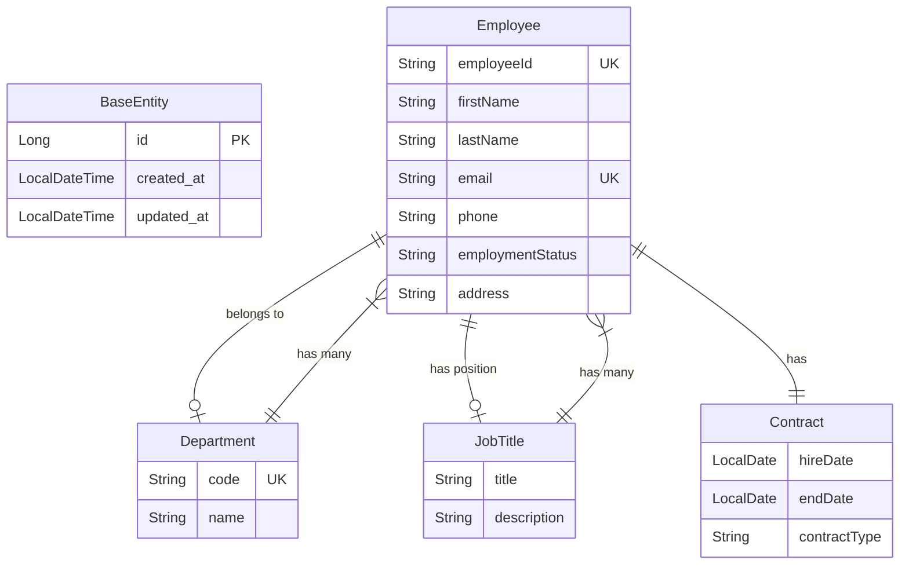

# Employee Records Management System

## Completed Tasks

### Phase 1: Initial Setup
- [x] Initial project setup with Java 17
- [x] Create main entities
- [x] Add SpringDoc config and fix database connection
- [x] Create CRUD blueprint with initial DTOs

### Phase 2: Core CRUD & Validation
- [x] Handle employee creation
- [x] Add missing validation package
- [x] Add global exception handling for common exceptions
- [x] Custom OpenAPI config
- [x] Exception handling with clear error messages
- [x] Handle update employee
- [x] Complete CRUD operations
    - [x] Get employee by id
    - [x] Get employee by employeeId
    - [x] Delete employee

### Phase 3: Security Implementation
- [x] Handle security
    - [x] Create security config and JWT authentication filter
    - [x] Create authentication endpoint
- [x] Configure bearer support in API documentation
- [x] Handle access denied exception
- [x] Implement role-based protection
- [x] Add roles to JWT token
- [x] Fix roles checking method
- [x] Add restriction to employees fields update for managers
- [x] Enhance endpoint security

### Phase 4: Advanced Features
- [x] Handle employee auditing
- [x] Add departments and job titles endpoints
- [x] Handle search employees functionality
- [x] Search employees security enhancements

### Phase 5: Deployment Setup
- [x] Create Dockerfile
- [x] Create docker-compose configuration
- [x] Create automated setup script

## Pending Tasks

### Phase 7: Testing
- [ ] Write unit tests
    - [ ] Service layer tests
    - [ ] Controller layer tests
    - [ ] Security tests
- [ ] Write integration tests
- [ ] Create Postman collection for API testing

### Phase 8: Documentation & Reporting
- [ ] Enhance API documentation
- [ ] Create video recording
- [ ] Implement basic reporting functionality
    - [ ] Employee list reports
    - [ ] Department statistics
    - [ ] Audit trail reports
- [ ] Enhance logging system

## Database Schema
